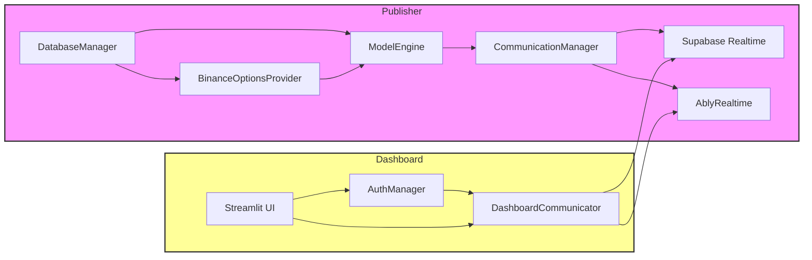

# 📈 Autonomous Options Trading Dashboard & Publisher

[](#license) []() []() []() []()

An end-to-end solution for autonomous options trading on Binance Options API—fetching live option chains, computing theoretical prices (Black-Scholes & beyond), storing & broadcasting data in real time, and visualizing insights through a rich Streamlit dashboard.

---

## 📋 Table of Contents

- [🚀 Features](#-features)  
- [🖥️ Architecture](#️-architecture)  
- [📂 Directory Structure](#-directory-structure)  
- [⚙️ Installation & Configuration](#️-installation--configuration)  
- [▶️ Usage](#️-usage)  
- [🔬 Theoretical Models](#-theoretical-models)  
- [🤝 Contributing](#-contributing)  
- [📜 License](#-license)  

---

## 🚀 Features

- **Data Publisher**  
  - Periodically polls user requests from Supabase  
  - Fetches live option chains via Binance Options API  
  - Calculates theoretical option prices (Black-Scholes)  
  - Stores market, options, and model data in Supabase  
  - Broadcasts updates in real time via Supabase Realtime & Ably  

- **Streamlit Dashboard**  
  - Secure Supabase-powered authentication  
  - Request new tickers & view/update your watchlist  
  - Interactive Options Chain table with P&L probability  
  - Heatmaps: fair value & expected P&L surfaces  
  - Monte Carlo simulations for price & P&L distributions  

- **Extensible Model Engine**  
  - Batch Black-Scholes processing  
  - Plug-and-play support for additional models (e.g., Monte Carlo, neural nets)  
  - Confidence scoring & parameter logging  

---

## 🖥️ Architecture



1. **DatabaseManager** (maindata.py) interacts with Supabase tables:  
   - `data_requests`, `options_data`, `market_data`, `model_results`, `user_api_keys`, `user_preferences`.

2. **BinanceOptionsProvider**  
   - Authenticates & fetches option symbols & prices from Binance’s eAPI.

3. **ModelEngine**  
   - Runs Black-Scholes batch calculations (and future models).

4. **CommunicationManager**  
   - Writes real-time broadcasts to Supabase & publishes via Ably.

5. **Streamlit Frontend** (dashboard_001.py)  
   - Manages login/signup, API key setup, preferences, data requests, and live charts.

---

## 📂 Directory Structure

```
.
├── maindata.py         # 🎛️ FinancialDataPublisher (core)
├── computes.py         # ⚙️ Utility functions & helpers
├── dashboard_001.py    # 🖥️ Streamlit frontend
├── requirements.txt    # 📦 Python dependencies
├── LICENSE             # 📄 MIT License
└── README.md           # 📘 Project overview
```

---

## ⚙️ Installation & Configuration

1. **Clone the repo**  
   ```bash
   git clone https://github.com/your_username/options_trading_dashboard.git
   cd options_trading_dashboard
   ```

2. **Install dependencies**  
   ```bash
   pip install -r requirements.txt
   ```

3. **Configure environment variables** (e.g., in `.env` or your shell):
   ```bash
   # Supabase
   export SUPABASE_URL="https://your.supabase.co"
   export SUPABASE_ANON_KEY="your_anon_key"
   export SUPABASE_SERVICE_KEY="your_service_role_key"

   # Ably (optional)
   export ABLY_API_KEY="your_ably_api_key"

   # Logging & timing
   export LOG_LEVEL="INFO"
   export UPDATE_INTERVAL="1.0"
   export REQUEST_CHECK_INTERVAL="5.0"
   ```

4. **(Optional) Streamlit secrets**  
   In `.streamlit/secrets.toml`:
   ```toml
   SUPABASE_URL = "https://your.supabase.co"
   SUPABASE_ANON_KEY = "your_anon_key"
   ABLY_API_KEY = "your_ably_api_key"
   ```

---

## ▶️ Usage

### 1. Start the Publisher
```bash
python maindata.py
```
It will:
- Poll new requests every 5s  
- Fetch & store options data  
- Compute & store model results  
- Broadcast updates

### 2. Launch the Dashboard
```bash
streamlit run dashboard_001.py
```
- Sign up / Log in via Supabase Auth  
- Configure your API keys  
- Request new tickers & explore your personalized dashboard

---

## 🔬 Theoretical Models

### Black-Scholes Formula

The Black-Scholes call price \(C\) and put price \(P\) are given by

$$
d_1 = \frac{\ln\!\bigl(\tfrac{S}{K}\bigr) + \bigl(r + \tfrac{\sigma^2}{2}\bigr)T}{\sigma\sqrt{T}},
\quad
d_2 = d_1 - \sigma\sqrt{T},
$$

$$
C = S\,\Phi(d_1) - K e^{-rT}\,\Phi(d_2),
\quad
P = K e^{-rT}\,\Phi(-d_2) - S\,\Phi(-d_1),
$$

where  
\(S\)=spot price, \(K\)=strike, \(r\)=risk-free rate,  
\(\sigma\)=volatility, \(T\)=time to expiry, \(\Phi\)=CDF of the standard normal.

---

## 🤝 Contributing

Contributions are welcome!  

1. Fork the repo  
2. Create a feature branch:  
   ```bash
   git checkout -b feature/amazing-model
   ```
3. Commit your changes  
4. Push & open a PR  
5. 🎉 We’ll review & merge!

---

## 📜 License

Distributed under the **MIT License**. See [LICENSE](LICENSE) for details.
